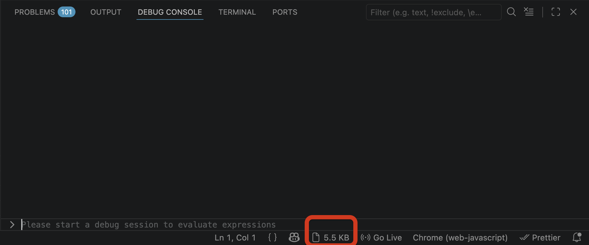

# Sizer

[](https://marketplace.visualstudio.com/items?itemName=JashwanthNeela.sizer)
[](https://marketplace.visualstudio.com/items?itemName=JashwanthNeela.sizer)
[](LICENSE)

See the size of any file right in the VS Code status bar — no need to leave your editor.



## Features

- Shows file size in the **status bar** as you switch between files
- Smart formatting — automatically picks B, KB, MB, or GB
- Updates on file save so the size always reflects what's on disk
- Works with every file type
- Lightweight — reads file metadata on demand, no background overhead

## Getting Started

1. Install **Sizer** from the [VS Code Marketplace](https://marketplace.visualstudio.com/items?itemName=JashwanthNeela.sizer)
2. Open any file — the size appears in the bottom-right status bar

That's it. No configuration needed.

## Settings

| Setting | Default | Options |
|---|---|---|
| `sizer.showSize` | `true` | Show or hide the file size display |
| `sizer.sizeFormat` | `auto` | `auto` (B/KB/MB/GB) or `bytes` (raw byte count) |

Open **Settings** (`Cmd+,` / `Ctrl+,`) and search for **Sizer** to configure.

## Commands

| Command | Description |
|---|---|
| `Sizer: Refresh` | Manually refresh the displayed file size |

Access via the Command Palette (`Cmd+Shift+P` / `Ctrl+Shift+P`).

## Troubleshooting

**Size not showing?** Make sure a file is open — the indicator hides when no file is active. Check that `sizer.showSize` is enabled, or try reloading the window.

**Size not updating after edits?** The size updates on save. Unsaved changes won't be reflected until the file is written to disk.

## Contributing

```bash
git clone https://github.com/NJashwanth/sizer.git
cd sizer
npm install
npm run compile
```

Press **F5** to launch the Extension Development Host and test locally.

## Author

Built by [Jashwanth Neela](https://jneela.dev/)

## License

[MIT](LICENSE)
